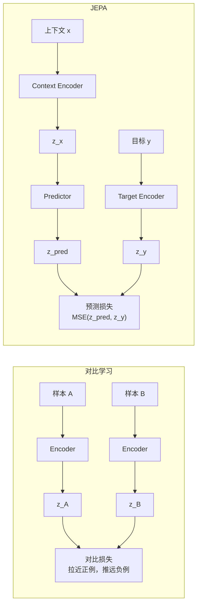
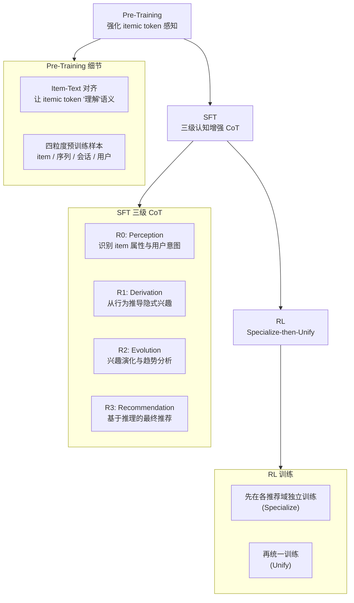
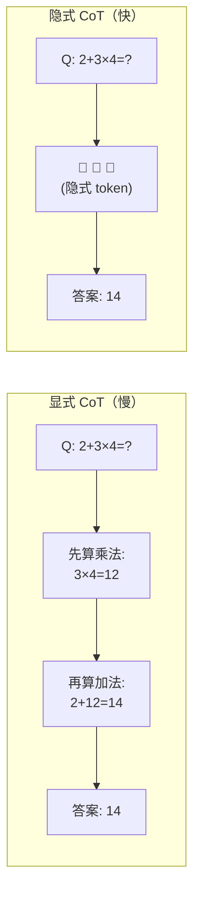
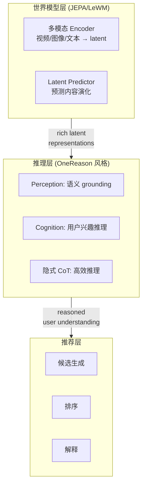

## 引言

我目前从事多模态表征模型的研发，应用于推荐场景。每天与海量的视频、图像、文本打交道，我们努力让模型理解用户的兴趣，精准推荐内容。然而，随着工作的深入，我开始思考一个更本质的问题：**模型真的"理解"了它所见的世界吗？** 还是仅仅学会了统计上的关联？

正是这个问题，将我引向了世界模型，尤其是 Yann LeCun 倡导的 [**JEPA（Joint Embedding Predictive Architecture）**](https://openreview.net/pdf?id=BZ5a1r-kVsf) 系列模型。与此同时，2025-2026 年涌现出两个令人兴奋的新方向：**将推理能力引入推荐系统**（如快手的 OneReason），以及**隐式思维链（Implicit CoT）**——让模型在隐藏状态中"思考"而非写出冗长的推理过程。本文尝试将这些线索串联起来，探讨它们对推荐系统未来的启示。

---

## 1. 从对比学习到 JEPA：从"区分"到"预测"

对比学习的核心思想是让相似的样本（正例）在嵌入空间中靠近，不相似的样本（负例）远离。这在视觉表征学习中取得了巨大成功，如 SimCLR、MoCo 等。但对比学习本质上是一种**判别式**方法——它学习的是样本之间的差异，而不是样本内在的结构。

而 JEPA 则试图走向**生成式**，但又不同于传统的像素级生成。JEPA 的核心理念是：**在抽象的表示空间中进行预测**。具体来说：

- 一个 **Encoder** 将输入（如视频的一帧）映射到表示空间
- 另一个 **Encoder** 将上下文（如之前的帧）也映射到同一空间
- 一个 **Predictor** 根据上下文表示去预测目标表示

整个过程中，模型不被要求重建像素，而是学习捕捉输入中**可预测的、任务相关的信息**。这种设计迫使模型忽略像素级的细节（如纹理、光照），而关注更抽象的、随时间变化的结构信息——这正是"世界模型"所需要的。

---

## 2. 世界模型与 JEPA 家族

### 2.1 经典工作回顾

"世界模型"的概念最早源于强化学习和机器人领域，经典工作如 David Ha 和 Jürgen Schmidhuber 的 [《World Models》](https://arxiv.org/abs/1803.10122)。他们将世界模型分为视觉编码器、循环记忆网络和控制器三部分，让智能体在"梦境"中想象未来。

LeCun 的 JEPA 不仅适用于单模态，还扩展到了多模态：

- **I-JEPA**：从图像的一个块预测另一个块的表示，学习语义结构。
- **V-JEPA**：从视频的过去帧预测未来帧的表示，学习时间演化。
- **A-JEPA**：类似地应用于音频。

### 2.2 LeWorldModel：JEPA 的实用化突破

2026 年 3 月，来自 Mila、NYU、Samsung SAIL 和 Brown University 的团队（包括 Yann LeCun 本人）发布了 [**LeWorldModel (LeWM)**](https://arxiv.org/abs/2603.19312)，这是 JEPA 路线的一个重要里程碑。

**核心创新**：LeWM 是第一个**仅用两个损失项**就能从原始像素端到端稳定训练的 JEPA 模型：

1. **预测损失** $\mathcal{L}_{\text{pred}}$：标准的 latent space 预测损失（MSE）
2. **SIGReg 正则化**：强制 latent embedding 服从高斯分布，防止表示坍塌

此前 JEPA 系统最大的痛点就是**表示坍塌（representation collapse）**——模型会"作弊"，把所有输入映射到同一个点，使预测损失恒为零。过去的方法需要堆砌复杂的多损失项、EMA target encoder、预训练编码器或辅助监督来避免坍塌。而 LeWM 的 SIGReg 优雅地将可调超参数从 6 个降到了 1 个。

**关键数据**：

| 指标 | LeWM | DINO-WM (对比) |
|:---|:---|:---|
| 参数量 | ~15M | 依赖预训练 ViT |
| 训练资源 | 单 GPU，数小时 | 多 GPU |
| 规划速度 | ~1 秒 | ~47 秒 (**48× 加速**) |
| 输入 | 纯像素（无 proprioceptive） | 像素 + 可能需要 proprioceptive |
| 每帧 token 数 | 192 维单 token | ~200× 更多 |

**设计哲学**：LeWM 将每帧图像编码为单个 192 维向量，而非 DINO-WM 那样使用大量 patch token。这种极致的压缩使得 latent space 中的规划（通过 Cross-Entropy Method 搜索最优动作序列）变得极其高效。在 Push-T、Reacher 等控制任务上，LeWM 以远低于 DINO-WM 的计算量达到了竞争甚至更优的性能。

更重要的是，LeWM 证明了 latent space 中确实编码了有意义的物理结构——通过对潜在表示的 probing，可以恢复物体的位置、速度等物理量。这表明 JEPA 不仅仅是"压缩"，而是真正学到了世界的内在规律。

---

## 3. 当推理遇见推荐：OneReason

### 3.1 推荐系统为什么需要推理？

传统推荐系统（包括基于生成式模型的新范式，如快手的 OneRec 系列）虽然能利用 scaling 的优势，但一直面临一个困境：**模型的"思考"能力难以被激活**。原因很简单——推荐任务中的 token 是"itemic token"（商品/视频 ID），而非自然语言，很难构造有意义的 Chain-of-Thought（CoT）序列。

2026 年 6 月，快手 OneRec 团队发布了 [**OneReason**](https://arxiv.org/abs/2606.06260)，系统性地探索了推荐系统中的推理能力。他们的初步实验（OneRec-Think、OpenOneRec）发现了一个令人意外的现象：**thinking mode 在推荐任务上并未表现出优于 non-thinking mode 的优势**。

### 3.2 OneReason 的核心设计

OneReason 将问题归结为两个关键因素：

1. **Perception（感知）**：模型需要将 itemic token 与底层语言语义建立联系（grounding）。如果模型不理解"这个视频 ID 代表什么内容"，后续推理就无从谈起。
2. **Cognition（认知）**：模型需要将用户的行为序列重组为连贯的潜在兴趣点，并在此基础上进行推理。

基于此，OneReason 提出了三阶段训练方案：

**三级认知增强 CoT 格式**：

- **R0: Perception** — 模型首先识别推荐上下文中的关键信息，如用户近期行为、item 的类别和属性
- **R1: Derivation** — 从用户的显式行为中推导隐式兴趣点，例如从"看了三个烹饪视频"推导出"对烘焙感兴趣"
- **R2: Evolution** — 分析兴趣的演化趋势，区分短期兴趣和长期偏好
- **R3: Recommendation** — 基于前三步的推理结果，给出最终推荐

### 3.3 关键发现

OneReason 最有趣的发现是：**用 CoT 监督数据替换非 CoT 推荐数据，可以在某些领域提升 non-thinking 推理的性能**。这意味着 CoT 监督带来的好处可能部分迁移到了直接解码——即使模型在推理时不显式生成思考过程，它也已经"内化"了推理能力。这天然地引向了下一个话题：隐式思维链。

---

## 4. 隐式思维链：让模型在"沉默"中思考

### 4.1 显式 CoT 的代价

Chain-of-Thought 虽然强大，但代价高昂。以 DeepSeek-R1、OpenAI o1 等推理模型为例，一次复杂推理可能生成数千个 thinking token。这些 token 消耗了大量计算资源，且推理延迟与 token 数量成正比。对于推荐系统这种对延迟高度敏感的场景，显式 CoT 的开销往往是不可接受的。

### 4.2 隐式 CoT 的核心思想

**隐式思维链（Implicit CoT / Latent CoT）** 的核心思路是：与其让模型逐字写出推理过程，不如让它在隐藏状态中完成推理。具体来说：

- 模型在生成最终答案之前，先经过几个"思考步骤"
- 这些步骤不产生自然语言 token，而是产生**隐式 token（latent tokens）**——特殊的 embedding 向量
- 隐式 token 经过 Transformer 的自注意力层进行信息交互，完成推理
- 最后，模型基于这些隐式 token 的状态生成最终答案

**关键优势**：
- **推理速度**：隐式 token 不需要经过 vocabulary projection 和采样，生成速度远快于自然语言 token
- **表示能力**：隐式 token 在连续向量空间中操作，不受离散词汇表的限制，可能表达更丰富的推理结构
- **端到端可微**：隐式 token 可以在训练时通过梯度优化

### 4.3 代表性工作

**SemCoT (He et al., 2025)**：通过知识蒸馏训练一个轻量级"隐式推理生成器"，将 ground-truth 推理过程压缩为隐式 token，同时用对比学习训练一个 sentence transformer 来保证隐式推理与显式推理的语义对齐。

**COCONUT (2024)**：在 latent space 中进行多步推理，每一轮将当前隐式状态反馈为下一轮的输入，形成一个"思考循环"。

**iCoT+ (Li et al., 2025)**：从理论上分析了隐式 CoT 的学习难度——当更多推理步骤被压缩到隐式 token 中时，学习难度呈指数增长。提出了分布对齐方法，通过给隐式 token 添加适度的监督信号来缓解这一问题。

**Anthropic Claude 的"零层架构"**：据社区分析，Claude 3.5 及之后版本内置了隐式推理能力——当检测到需要多步推理的输入模式时，模型会在内部自动激活推理节点，整个过程不产生任何中间文本。这是隐式 CoT 在商业产品中的实际应用。

### 4.4 隐式 CoT 的局限性

尽管隐式 CoT 前景广阔，但当前仍面临挑战：

1. **训练困难**：缺乏显式监督信号，隐式 token 容易退化为无意义的噪声
2. **可解释性缺失**：无法像显式 CoT 那样"看到"模型的推理过程，对安全审计构成挑战
3. **"外部化推理假说"**：Korbak et al. (2025) 指出，在 Transformer 中，足够长的计算必须在 token 序列中"写出"——受限于层深，模型无法无限期地"默默思考"。这意味着对于极其复杂的推理，隐式 CoT 可能不适用
4. **忠实性问题**：有研究表明，显式 CoT 的推理过程并不总是忠实于模型的真实内部计算（模型可能"撒谎"）。隐式 CoT 让这个问题更加隐蔽

---

## 5. 三条线索的交汇：对推荐系统的启示

将世界模型、推理推荐和隐式推理放在一起审视，可以看到一条清晰的脉络：

### 5.1 世界模型 → 更好的内容理解

JEPA 和 LeWM 提供的"在 latent space 中预测未来"的能力，天然适用于推荐场景中的内容理解：
- 让模型预测视频的后续帧（在表示空间），迫使其学会识别动作、场景变化、物体交互
- 这些隐含知识可以迁移到推荐任务中，提升对视频质量的判断
- LeWM 的效率（15M 参数、单 GPU 训练）使得在工业级数据上训练世界模型变得可行

### 5.2 推理推荐 → 更深层的用户建模

OneReason 的经验表明，仅仅"让模型思考"是不够的——需要精心设计的感知机制和认知层次：
- **Perception**：世界模型提供的多模态表示可以帮助 itemic token 实现更好的语义 grounding
- **Cognition**：三级认知 CoT（Perception → Derivation → Evolution → Recommendation）提供了一个可复用的推理框架
- **RL 训练**："先专后统"的 RL 策略可以扩展到更多推荐领域

### 5.3 隐式推理 → 推理的实用化

对于推荐系统，隐式 CoT 可能是连接"强大推理能力"和"严苛延迟要求"的桥梁：
- OneReason 的发现（CoT 监督可提升 non-thinking 性能）表明，即使推理时不显式生成 CoT，模型也能从推理训练中获益
- 隐式 CoT 可以进一步降低推理延迟，使"思考"在推荐系统中变得实用
- 世界模型的 latent space 预测天然就是一种隐式推理——在连续表示空间中预测未来，而非生成像素

### 5.4 一个可能的未来架构

---

## 6. 总结

从对比学习到 JEPA，从 JEPA 到 LeWM，从推荐到推理，从显式 CoT 到隐式 CoT——这些看似独立的技术线索，正在推荐系统这个交汇点上逐渐融合。

**LeWorldModel** 证明了 JEPA 路线的实用可行性：15M 参数、单 GPU、端到端训练，却能学到有意义的物理世界动态。**OneReason** 证明了推荐系统可以通过精心设计的感知-认知-推理管道获得 thinking 能力的提升。**隐式 CoT** 则为推理的实用化提供了效率上的可能。

如果说有一个核心洞察贯穿始终，那就是：**在连续表示空间中进行预测和推理，而非在离散 token 空间中生成**——这既是 JEPA 的哲学，也是隐式 CoT 的方向，或许也是推荐系统智能化的关键。

---

## 参考文献

1. Maes, L., Le Lidec, Q., Scieur, D., LeCun, Y., & Balestriero, R. (2026). LeWorldModel: Stable End-to-End Joint-Embedding Predictive Architecture from Pixels. *arXiv:2603.19312*.
   *LeWM: 首个仅用两个损失项端到端稳定训练的 JEPA，15M 参数，48× 规划加速。*

2. OneRec Team. (2026). OneReason Technical Report. *arXiv:2606.06260*.
   *快手推荐系统的推理增强方案，三级认知 CoT + specialize-then-unify RL。*

3. He, Y., Zheng, W., Zhu, Y., et al. (2025). SemCoT: Accelerating Chain-of-Thought Reasoning through Semantically-Aligned Implicit Tokens. *arXiv:2510.24940*.
   *通过知识蒸馏和对比学习实现语义对齐的隐式 CoT。*

4. Li, J., Li, R., Zhou, Y., & Pan, J. Z. (2025). Dissecting Implicit Chain of Thought: Can Transformers Learn It Spontaneously? *Submitted to ICLR 2026*.
   *理论分析隐式 CoT 的学习难度，提出分布对齐方法 iCoT+。*

5. Korbak, T., et al. (2025). Chain-of-Thought Monitorability: A New and Fragile Opportunity for AI Safety. *Position Paper*.
   *探讨 CoT 监控的脆弱性及"外部化推理假说"。*

6. LeCun, Y. (2022). A Path Towards Autonomous Machine Intelligence. *OpenReview*.
   *JEPA 架构的纲领性论文。*

7. Ha, D., & Schmidhuber, J. (2018). World Models. *NeurIPS 2018*.
   *世界模型概念的经典工作。*

8. Chen, S., et al. (2025). Reasoning Models Will Blatantly Lie About Their Reasoning. *ACL 2025*.
   *揭示推理模型 CoT 的不忠实性问题。*