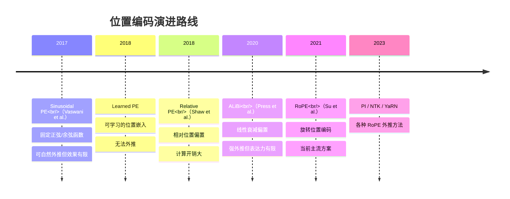
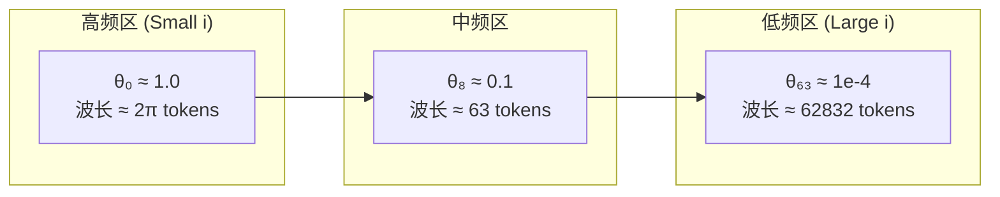
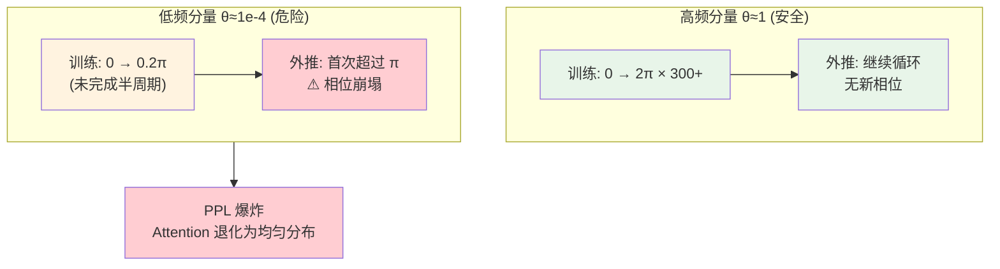
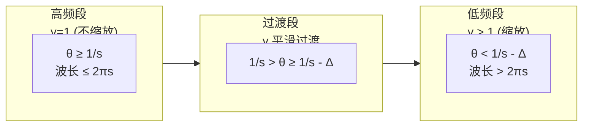
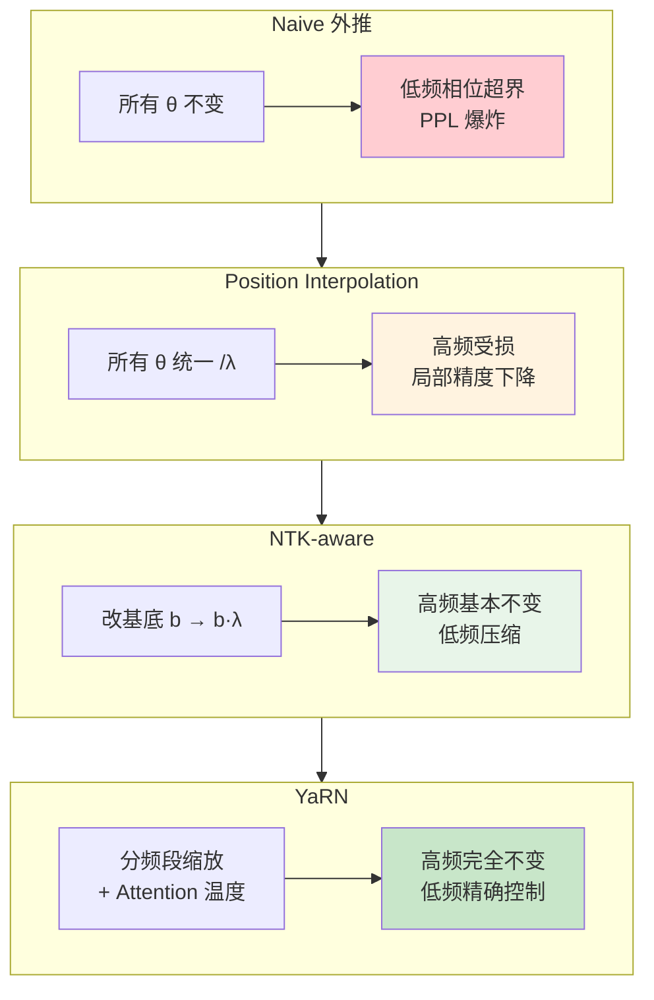

## 前言：位置编码为什么重要

Transformer 的自注意力机制本身是**置换等变的**——如果你把输入序列中任意两个 token 的位置互换，对应的输出也会以完全相同的方式互换。换句话说，纯粹的 Attention 对"顺序"毫无感知。但自然语言显然是有序的："猫追老鼠"和"老鼠追猫"意思完全不同。因此，我们需要一种方式把位置信息注入模型，这就是**位置编码（Positional Encoding）**。

然而，位置编码不仅仅是"让模型知道顺序"这么简单。它决定了模型能否在比训练时更长的序列上正常推理（即**长度外推**），也直接影响了上下文窗口的扩展成本。近年来，围绕 RoPE 及其外推方法（如 PI、NTK-aware、YaRN）的一系列工作，揭示了位置编码背后一个极其优雅的数学结构——**频谱与相位的视角**。本文将对这一脉络做一次系统的梳理。

---

## 1. 位置编码简史

在深入 RoPE 之前，先回顾一下位置编码的发展脉络：

### 1.1 绝对位置编码：Sinusoidal PE

Transformer 原始论文（Vaswani et al., 2017）使用了一组固定的正弦/余弦函数来编码位置：

$$
\begin{aligned}
\text{PE}(pos, 2i) &= \sin\left(\frac{pos}{10000^{2i/d}}\right) \\
\text{PE}(pos, 2i+1) &= \cos\left(\frac{pos}{10000^{2i/d}}\right)
\end{aligned}
$$

其中 $pos$ 是位置索引，$i$ 是维度索引，$d$ 是总维度。这个设计有两个关键特性：

1. **不同频率**：不同维度 $i$ 对应不同的正弦波波长，从 $2\pi$ 到 $\sim 10000 \cdot 2\pi$ 不等。
2. **可线性外推**：由于函数是确定性的，理论上 $pos$ 可以取任意值。但实践中，模型在训练时只见过 $[0, L_{\text{train}}]$ 内的位置，外推性能并不理想。

**可学习的位置嵌入**（如 BERT、GPT-2）则是为每个位置分配一个可训练向量，但完全无法外推——一旦序列超出训练长度，就会遇到从未见过的位置索引。

### 1.2 相对位置编码

另一条路线是**相对位置编码**——不关心绝对位置，而是告诉 Attention："token A 和 token B 之间的距离是 $r$"。

- **Shaw et al. (2018)**：在 Attention 计算中加入可学习的相对位置偏置 $a_{ij} \propto q_i \cdot (k_j + r_{i-j})$，但计算开销较大。
- **T5 (Raffel et al., 2020)**：将相对位置映射为标量偏置，直接加到 Attention logits 上。
- **ALiBi (Press et al., 2020)**：极其简洁——给 Attention logits 加一个线性衰减偏置 $-(i-j) \cdot m$，其中 $m$ 是头特定的斜率。ALiBi 在长度外推上表现惊人，但绝对位置信息的缺失在某些任务上可能成为瓶颈。

这一系列探索最终汇聚到了 2021 年的一个优雅方案：**RoPE**。

---

## 2. RoPE：旋转位置编码详解

RoPE（Rotary Position Embedding）的核心思想是：**用旋转矩阵对 query 和 key 向量进行位置相关的变换，使得 Attention 内积自然地只依赖于相对位置。**

### 2.1 数学定义

对于一个 $d$ 维向量 $\mathbf{x} = (x_0, x_1, x_2, x_3, \dots, x_{d-2}, x_{d-1})$，RoPE 将其按相邻维度配对为 $d/2$ 个二维子空间，然后在每个子空间内进行旋转。

对于位置 $m$，第 $i$ 个二维子空间（维度 $2i$ 和 $2i+1$）的旋转角度为：

$$
\phi_i(m) = m \cdot \theta_i, \qquad \theta_i = 10000^{-2i/d}, \quad i = 0,1,\dots,d/2-1
$$

旋转操作写为矩阵形式：

$$
R_{\theta_i, m} = \begin{bmatrix}
\cos(m\theta_i) & -\sin(m\theta_i) \\
\sin(m\theta_i) & \cos(m\theta_i)
\end{bmatrix}
$$

整个 $d$ 维旋转矩阵 $R_m$ 是这些 $2\times2$ 块的直和：

$$
R_m = \text{diag}\big(R_{\theta_0, m}, R_{\theta_1, m}, \dots, R_{\theta_{d/2-1}, m}\big)
$$

RoPE 对 query $\mathbf{q}$ 和 key $\mathbf{k}$ 分别应用旋转：

$$
\mathbf{q}_m = R_m \cdot \mathbf{q}, \qquad \mathbf{k}_n = R_n \cdot \mathbf{k}
$$

### 2.2 关键性质：相对位置内积

RoPE 最精巧的性质在于 Attention 内积的结果：

$$
\begin{aligned}
\mathbf{q}_m^\top \mathbf{k}_n &= (R_m \mathbf{q})^\top (R_n \mathbf{k}) \\
&= \mathbf{q}^\top R_m^\top R_n \mathbf{k} \\
&= \mathbf{q}^\top R_{n-m} \mathbf{k}
\end{aligned}
$$

最后一步利用了旋转矩阵的性质：$R_m^\top R_n = R_{n-m}$（因为 $R_m$ 是正交矩阵，且 $R_m^\top = R_{-m}$）。这意味着**内积只依赖于相对位置 $(n-m)$**，而与绝对位置无关。这正是我们希望相对位置编码做的事情，但 RoPE 通过旋转操作以一种极其自然的方式实现了它。

### 2.3 频率谱

$\theta_i = 10000^{-2i/d}$ 这个设计产生了一个**几何级数分布的频率谱**：

- **高频分量**（$i$ 小，$\theta_i$ 接近 $1$）：编码**局部**位置关系，一个周期只有几个 token。在训练期间已经完成了大量完整周期。
- **低频分量**（$i$ 大，$\theta_i$ 接近 $0$）：编码**远程**位置关系，周期可能远超训练长度。在训练期间可能连半个周期都没走完。

这个频谱结构是理解长度外推问题的关键。

---

## 3. 长度外推问题：为什么直接外推会失败

### 3.1 问题描述

假设模型在 $[0, L_{\text{train}}]$ 上训练，现在要处理长度为 $L_{\text{test}} \gg L_{\text{train}}$ 的序列。

对于每个频率分量 $\theta_i$，模型在训练期间见过的相位范围是 $[0, \theta_i L_{\text{train}}]$。当 $L_{\text{test}}$ 远大于 $L_{\text{train}}$ 时：

- **高频分量**：$\theta_i L_{\text{train}} \gg 2\pi$，训练期间已经遍历了多个完整周期。外推只是继续在已见过的相位空间内采样，**不会遇到新情况**。
- **低频分量**：$\theta_i L_{\text{train}} < \pi$，训练期间连半个周期都没走完。当 $\theta_i L_{\text{test}} > \pi$ 时，模型**首次遇到超过 $\pi$ 的相位值**——这是训练分布中从未出现过的输入。

### 3.2 直观理解

可以这样理解：高频分量就像秒针，在训练期间已经转了无数圈，早已"见多识广"；低频分量则像时针，训练期间只走了几分钟的角度，突然让它指向下午，它从未学过"下午"应该是什么样子。模型在低频分量上遇到了**分布外（OOD）的相位输入**，导致 Attention 权重计算崩溃，最终反映为 perplexity 的急剧上升。

---

## 4. 解决方案：从 PI 到 YaRN

### 4.1 Position Interpolation (PI)

**论文**：Chen et al., "Extending Context Window of Large Language Models via Positional Interpolation" (2023)

**核心操作**：将外推的所有位置索引按比例缩小回训练范围内。

$$
m' = m \cdot \frac{L_{\text{train}}}{L_{\text{test}}}
$$

效果相当于对所有频率施加统一的缩放因子 $\lambda = L_{\text{test}} / L_{\text{train}}$：

$$
\theta_i' = \theta_i / \lambda
$$

**优点**：简单直接，只需少量微调即可恢复性能。
**缺点**：**高频分量也被等比例压缩**。原本 $\theta_0 \approx 1$ 的高频分量被压成 $\theta_0' \approx 1/\lambda$，局部 token 之间的区分度下降（"秒针走得太慢了"），导致短距离依赖的精度受损。

### 4.2 NTK-aware Scaling

**提出者**：bloc97 (2023)，受到 NTK（Neural Tangent Kernel）理论启发。

**核心想法**：不直接缩放位置索引，而是调整 RoPE 的基底频率。具体做法是将 $\theta_i$ 的基底从 $10000$ 改为

$$
b' = b \cdot \lambda^{d/(d-2)} \approx b \cdot \lambda
$$

这在效果上等价于**对低频分量进行更强的缩放，而高频分量变化较小**。具体来说：

$$
\theta_i' = (b \cdot \lambda^{d/(d-2)})^{-2i/d}
$$

当 $i$ 很小时，$\theta_i' \approx \theta_i$（高频不变）；当 $i$ 很大时，$\theta_i' \approx \theta_i / \lambda$（低频压缩）。

**改进**：比 PI 更好地保护了高频信息，但仍缺乏对每个频率分量的精细控制。

### 4.3 YaRN：分频段缩放

**论文**：Peng et al., "YaRN: Efficient Context Window Extension of Large Language Models" (2023)

YaRN 是目前最有效且被广泛采用的 RoPE 外推方法（Llama 系列的长上下文版本如 CodeLlama、Llama 3 等均受其影响）。其核心公式为：

$$
\gamma_i = 
\begin{cases}
1 & \text{if } \theta_i \geq \frac{1}{s} \\[6pt]
\displaystyle \left(1 - \frac{\theta_i \cdot s - 1}{\Delta} \right)^p & \text{if } \frac{1}{s} > \theta_i \geq \frac{1}{s} - \Delta \\[6pt]
\displaystyle \left(\frac{1}{\theta_i \cdot s}\right)^p & \text{if } \theta_i < \frac{1}{s} - \Delta
\end{cases}
$$

其中 $s$ 是目标扩展倍数，$p$ 和 $\Delta$ 是超参数。缩放后的频率为 $\theta_i' = \theta_i / \gamma_i$。

**分段策略**：

**设计思想**：

1. **高频不缩放**（$\gamma=1$）：局部相邻 token 的关系（如"猫"和"追"之间的语法依赖）不应因序列变长而改变。这保证了模型在短距离上的精度不受影响。

2. **低频大幅缩放**（$\gamma>1$）：将超长周期的分量进一步"拉伸"，使其在扩展后的序列上仍然保持在一个"安全"的相位范围内，避免进入未见过的相位区域。

3. **过渡段平滑**：在高低频之间设置一个平滑过渡区域，避免频率谱上的突变。

**额外的"温度"技巧**：YaRN 还引入了一个 Attention 温度缩放因子 $\sqrt{1/\tau}$，用于在不同注意力头之间平衡"局部聚焦"和"远程感知"——这是对 ALiBi 思想的继承。

---

## 5. 方法对比

| 方法 | 高频处理 | 低频处理 | 需微调 | 外推效果 |
|:---|:---|:---|:---|:---|
| Naive 外推 | 不变 | 不变 | 否 | 差 |
| Position Interpolation | 统一压缩 | 统一压缩 | 是（少量） | 中 |
| NTK-aware Scaling | 基本不变 | 压缩 | 否 | 良 |
| YaRN | 完全不变 | 分频段缩放 | 是（少量） | 优 |

---

## 6. 更深层的视角：频谱、相位与"训练视界"

### 6.1 训练长度作为"视界"

回顾这个核心事实：**低频分量在训练期间从未完成一个完整的周期。** 这意味着对于这些分量，训练长度 $L_{\text{train}}$ 定义了一个天然的"视界"——超出这个视界，模型对其相位行为一无所知。

高维空间中的 $d/2$ 个旋转平面，每个都有自己的"视界"（取决于 $\theta_i$）。训练过程实际上是在一个受限的相位子空间里学习 Attention 映射。当外推序列的长度迫使某个低频分量首次越过 $\pi$ 相位时，该分量就经历了一次**相变**——模型被推入了一个从未探索过的输入区域。

### 6.2 从信号处理的角度理解

如果你熟悉傅里叶分析，这个视角非常自然：

- RoPE 本质上是对 embedding 向量做了一个**位置相关的频域变换**。
- $\theta_i$ 就是第 $i$ 个频率通道的基频。
- 训练期间，每个通道的"采样范围"是 $[0, \theta_i L_{\text{train}}]$。
- 低频通道的采样不足（欠奈奎斯特采样），导致外推时的**混叠/失真**。

YaRN 做的事情，本质上是对不同频率通道做**自适应重采样**——让低频通道的等效采样率提高，从而避免失真。

### 6.3 这不仅仅是比喻

上述"视界"和"相变"的讨论并非文学修辞，而是对 RoPE 数学结构的忠实描述。$SO(2)$ 群的旋转操作天然地定义了相位空间和周期，而训练长度确实在相位空间中划定了一个有限的采样区域。当外推越过这个区域的边界，模型的行为改变是**必然的**——不是因为模型"不够好"，而是因为输入分布发生了根本性的偏移。

理解这一点，也就理解了为什么 YaRN 的分频段策略如此有效：它精确地识别了每个频率通道的"安全边界"，并对低频通道做了预防性的"拉伸"，确保在外推范围内所有通道都保持在训练分布覆盖的相位区域内。

---

## 7. 总结

1. **位置编码的本质**是让 Transformer 感知序列顺序。从 Sinusoidal PE 到 RoPE，这条演进路线一直在追求更优雅的数学结构。
2. **RoPE 的核心**是通过 $SO(2)$ 旋转将位置信息编码到 query/key 中，使得 Attention 内积自然地只依赖相对位置，同时产生了一个几何级数分布的频率谱。
3. **长度外推失败的根本原因**在于低频分量在训练期间采样不足——当外推使其相位首次超过 $\pi$ 时，模型遇到了分布外输入。
4. **YaRN 的解决方案**是分频段缩放：高频不变（保护局部精度），低频拉伸（避免相位超界），配合 Attention 温度调节，在最小微调成本下实现最优的外推效果。

位置编码的故事还在继续——更长的上下文、更高效的扩展方法、更深刻的数学理解，都是活跃的研究方向。但有一点已经清晰：**把位置编码看作一个频谱问题，而不是简单的"位置标签"，是理解这一切的关键。**

---

## 参考文献

1. Vaswani, A., et al. (2017). Attention Is All You Need. *NeurIPS 2017*.
   *原始 Transformer 论文，提出了 Sinusoidal Positional Encoding。*

2. Shaw, P., Uszkoreit, J., & Vaswani, A. (2018). Self-Attention with Relative Position Representations. *NAACL 2018*.
   *首次提出相对位置编码。*

3. Press, O., Smith, N. A., & Lewis, M. (2021). Train Short, Test Long: Attention with Linear Biases Enables Input Length Extrapolation. *ICLR 2022*.
   *提出 ALiBi，线性偏置实现强外推。*

4. Su, J., Lu, Y., Pan, S., Murtadha, A., Wen, B., & Liu, Y. (2021). RoFormer: Enhanced Transformer with Rotary Position Embedding. *arXiv:2104.09864*.
   *RoPE 原始论文，提出基于旋转的位置编码。*

5. Chen, S., Wong, S., Chen, L., & Tian, Y. (2023). Extending Context Window of Large Language Models via Positional Interpolation. *arXiv:2306.15595*.
   *提出 Position Interpolation 方法。*

6. bloc97. (2023). NTK-Aware Scaled RoPE. *GitHub Gist*.
   *提出 NTK-aware 缩放方法。*

7. Peng, B., Quesnelle, J., Fan, H., & Shippole, E. (2023). YaRN: Efficient Context Window Extension of Large Language Models. *arXiv:2309.00071*.
   *提出 YaRN 分频段缩放方法，当前最有效的 RoPE 外推方案。*

8. Liu, X., Yan, H., Zhang, S., An, C., Qiu, X., & Lin, D. (2024). Scaling Laws of RoPE-based Extrapolation. *ICLR 2024*.
   *对 RoPE 外推行为的系统性实证与理论分析。*