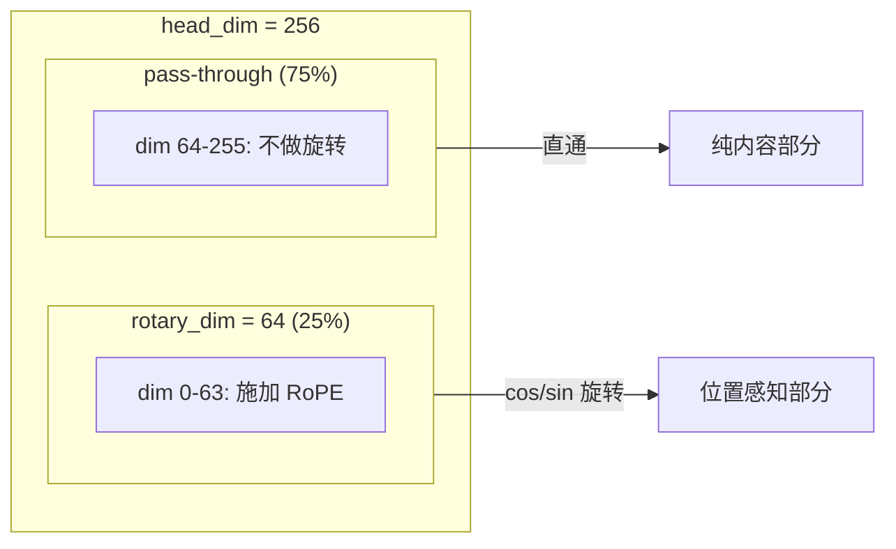
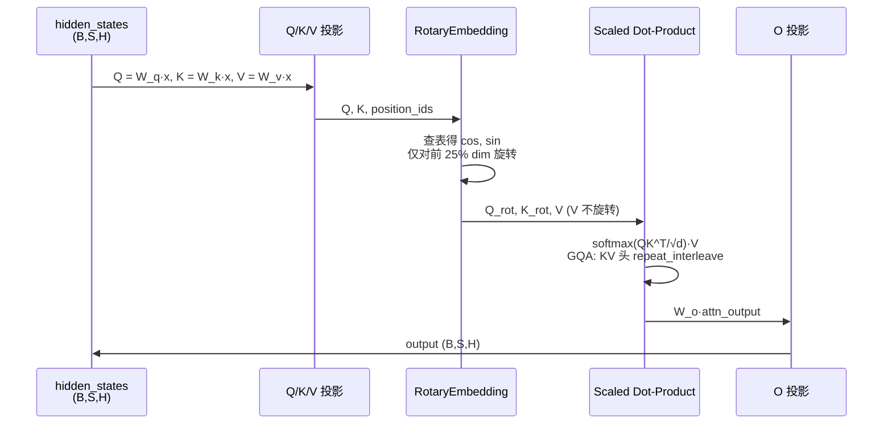
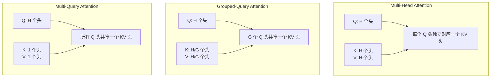
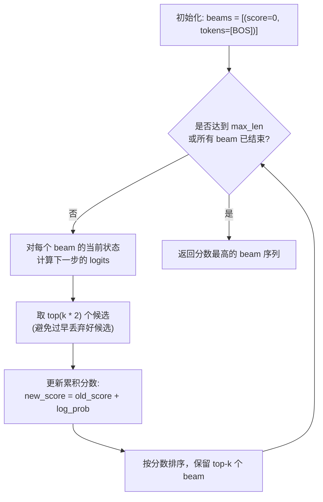

## 前言

本文以 Qwen3.5 为参考，系统梳理现代 LLM 中的四个核心机制：

1. **RoPE 旋转位置编码**：Qwen3.5 中的具体实现，包括 Partial RoPE 的设计与 Transformer 层中的集成方式。
2. **多头注意力的三种变体**：MHA、MQA、GQA 的原理、代码实现与内存-性能权衡。
3. **Beam Search 解码**：从贪心到束搜索的完整算法与实现。
4. **受限解码**：词表子集约束与字典树（Trie）约束的原理与代码。

所有代码片段均基于 PyTorch，力求可独立运行。

---

## 1. RoPE 在 Qwen3.5 中的实现

### 1.1 RoPE 数学回顾

RoPE 的核心思想是：对 query 和 key 向量施加位置相关的旋转，使得 Attention 内积只依赖于相对位置。

对于 $d$ 维向量 $\mathbf{x}$，将其按相邻维度配对为 $d/2$ 个二维子空间。第 $i$ 个二维子空间（维度 $2i$ 和 $2i+1$）在位置 $m$ 处的旋转角度为：

$$
\phi_i(m) = m \cdot \theta_i, \qquad \theta_i = \text{base}^{-2i/d}
$$

其中 $\text{base}$ 是 RoPE 的基底频率（Qwen3.5 中为 $10\,000\,000$）。旋转矩阵为：

$$
R_{\theta_i, m} = \begin{bmatrix}
\cos(m\theta_i) & -\sin(m\theta_i) \\
\sin(m\theta_i) & \cos(m\theta_i)
\end{bmatrix}
$$

关键性质：$R_m^\top R_n = R_{n-m}$，因此 Attention 内积 $\mathbf{q}_m^\top \mathbf{k}_n = \mathbf{q}^\top R_{n-m} \mathbf{k}$ 仅依赖于相对位置 $(n-m)$。

### 1.2 Qwen3.5 的 RoPE 配置

Qwen3.5 的 RoPE 有三个重要特点：

| 参数 | 值 | 含义 |
|:---|:---|:---|
| `rope_theta` | $10\,000\,000$ | 基底频率，远大于 Llama 的 $10\,000$，天然支持更长上下文 |
| `partial_rotary_factor` | $0.25$ | 仅对 head_dim 的前 25% 维度施加 RoPE，剩余维度不做旋转 |
| `rope_scaling` | YaRN | 可通过 YaRN 进一步扩展到 1M+ tokens |

**Partial RoPE** 的设计动机：将旋转位置编码只作用于部分维度，其余维度保留为"内容通道"（content-only），这种做法在实践中被证明能更好地平衡位置感知与内容表达。

下图展示了 Partial RoPE 的维度分配：



### 1.3 RoPE 完整实现

```python
import torch
import torch.nn as nn
import math
from typing import Tuple


class Qwen3_5RotaryEmbedding(nn.Module):
    """Qwen3.5 风格的 Rotary Position Embedding。
    
    特点：
    - Partial RoPE: 仅对 head_dim 的前 partial_rotary_factor 比例施加旋转
    - 高 rope_theta: 默认 10_000_000，支持长上下文
    """

    def __init__(
        self,
        head_dim: int = 256,
        max_position_embeddings: int = 262144,
        rope_theta: float = 10_000_000.0,
        partial_rotary_factor: float = 0.25,
    ):
        super().__init__()
        self.head_dim = head_dim
        self.max_position_embeddings = max_position_embeddings
        self.rope_theta = rope_theta
        self.partial_rotary_factor = partial_rotary_factor

        # 实际施加 RoPE 的维度数
        self.rotary_dim = int(head_dim * partial_rotary_factor)

        # 计算逆频率: inv_freq[i] = 1 / (theta^(2i/rotary_dim))
        # 注意：分母用 rotary_dim 而非 head_dim
        inv_freq = 1.0 / (
            rope_theta ** (
                torch.arange(0, self.rotary_dim, 2, dtype=torch.float)
                / self.rotary_dim
            )
        )
        self.register_buffer("inv_freq", inv_freq, persistent=False)

        # 预计算 cos 和 sin 表
        self._set_cos_sin_cache(
            seq_len=max_position_embeddings,
            device=inv_freq.device,
            dtype=torch.float,
        )

    def _set_cos_sin_cache(self, seq_len, device, dtype):
        """预计算位置 0..seq_len-1 的 cos/sin 值。"""
        self.max_seq_len_cached = seq_len
        t = torch.arange(seq_len, device=device, dtype=torch.float)

        # freqs: (seq_len, rotary_dim/2)
        freqs = torch.outer(t, self.inv_freq)

        # emb: (seq_len, rotary_dim) — 每对相邻维度是 (cos, sin)
        emb = torch.cat((freqs, freqs), dim=-1)
        self.register_buffer("cos_cached", emb.cos(), persistent=False)
        self.register_buffer("sin_cached", emb.sin(), persistent=False)

    def forward(
        self, x: torch.Tensor, position_ids: torch.Tensor
    ) -> Tuple[torch.Tensor, torch.Tensor]:
        """获取指定位置的 cos 和 sin 值。

        Args:
            x: 输入 tensor (用于确定 dtype)
            position_ids: (batch, seq_len) 位置索引

        Returns:
            cos, sin: 形状均为 (batch, seq_len, rotary_dim)
        """
        cos = self.cos_cached[position_ids].to(x.dtype)  # (B, S, rotary_dim)
        sin = self.sin_cached[position_ids].to(x.dtype)
        return cos, sin


def apply_rotary_emb(
    x: torch.Tensor,
    cos: torch.Tensor,
    sin: torch.Tensor,
) -> torch.Tensor:
    """对输入张量施加旋转位置编码。

    将 x 的 rotary_dim 部分按 (cos, sin) 进行 2D 旋转。

    Args:
        x: (batch, num_heads, seq_len, head_dim)
        cos: (batch, seq_len, rotary_dim)
        sin: (batch, seq_len, rotary_dim)

    Returns:
        rotated: 与 x 同形状
    """
    batch, num_heads, seq_len, head_dim = x.shape
    rotary_dim = cos.shape[-1]

    # 分离需要旋转的部分和直通的部分
    x_rotary = x[..., :rotary_dim]           # (B, H, S, rotary_dim)
    x_pass = x[..., rotary_dim:]             # (B, H, S, head_dim - rotary_dim)

    # 扩展 cos/sin 维度以匹配 x_rotary
    cos = cos.unsqueeze(1)  # (B, 1, S, rotary_dim)
    sin = sin.unsqueeze(1)

    # 将 rotary_dim 重组为 (rotary_dim/2, 2) 以进行 2D 旋转
    x_rotary = x_rotary.reshape(batch, num_heads, seq_len, rotary_dim // 2, 2)
    x_rotary_0, x_rotary_1 = x_rotary[..., 0], x_rotary[..., 1]

    cos = cos.reshape(batch, 1, seq_len, rotary_dim // 2, 2)
    sin = sin.reshape(batch, 1, seq_len, rotary_dim // 2, 2)
    cos_0, sin_0 = cos[..., 0], sin[..., 0]  # 取每对的 cos

    # 2D 旋转: (x0, x1) -> (x0*cos - x1*sin, x0*sin + x1*cos)
    x_out_0 = x_rotary_0 * cos_0 - x_rotary_1 * sin_0
    x_out_1 = x_rotary_0 * sin_0 + x_rotary_1 * cos_0

    x_rotary_out = torch.stack([x_out_0, x_out_1], dim=-1).reshape(
        batch, num_heads, seq_len, rotary_dim
    )

    # 拼接旋转部分和直通部分
    return torch.cat([x_rotary_out, x_pass], dim=-1)
```

### 1.4 在 Qwen3.5 Transformer 层中的使用

下面是 Qwen3.5 Attention 模块中 RoPE 的调用方式。核心流程是：先投影出 Q/K/V，再对 Q 和 K 施加 RoPE，最后计算 Attention。

```python
class Qwen3_5Attention(nn.Module):
    """Qwen3.5 的 Full Attention 层（带 GQA 和 Partial RoPE）。"""

    def __init__(
        self,
        hidden_size: int = 4096,
        num_heads: int = 32,
        num_kv_heads: int = 2,
        head_dim: int = 256,
        partial_rotary_factor: float = 0.25,
        rope_theta: float = 10_000_000.0,
        max_position_embeddings: int = 262144,
    ):
        super().__init__()
        self.hidden_size = hidden_size
        self.num_heads = num_heads
        self.num_kv_heads = num_kv_heads
        self.head_dim = head_dim
        self.num_key_value_groups = num_heads // num_kv_heads

        # Q, K, V 投影矩阵
        self.q_proj = nn.Linear(hidden_size, num_heads * head_dim, bias=False)
        self.k_proj = nn.Linear(hidden_size, num_kv_heads * head_dim, bias=False)
        self.v_proj = nn.Linear(hidden_size, num_kv_heads * head_dim, bias=False)
        self.o_proj = nn.Linear(num_heads * head_dim, hidden_size, bias=False)

        # RoPE 模块
        self.rotary_emb = Qwen3_5RotaryEmbedding(
            head_dim=head_dim,
            max_position_embeddings=max_position_embeddings,
            rope_theta=rope_theta,
            partial_rotary_factor=partial_rotary_factor,
        )

    def forward(
        self,
        hidden_states: torch.Tensor,
        attention_mask: torch.Tensor = None,
        position_ids: torch.Tensor = None,
    ) -> torch.Tensor:
        """
        Args:
            hidden_states: (batch, seq_len, hidden_size)
            attention_mask: (batch, 1, seq_len, seq_len) 或 None
            position_ids: (batch, seq_len)
        """
        batch, seq_len, _ = hidden_states.shape

        # 1. 投影 Q, K, V
        query_states = self.q_proj(hidden_states)
        key_states = self.k_proj(hidden_states)
        value_states = self.v_proj(hidden_states)

        # 2. 重塑为多头形状
        # Q: (B, S, num_heads, head_dim) -> (B, num_heads, S, head_dim)
        query_states = query_states.view(
            batch, seq_len, self.num_heads, self.head_dim
        ).transpose(1, 2)
        key_states = key_states.view(
            batch, seq_len, self.num_kv_heads, self.head_dim
        ).transpose(1, 2)
        value_states = value_states.view(
            batch, seq_len, self.num_kv_heads, self.head_dim
        ).transpose(1, 2)

        # 3. 施加 RoPE（仅对 Q 和 K）
        cos, sin = self.rotary_emb(query_states, position_ids)
        query_states = apply_rotary_emb(query_states, cos, sin)
        key_states = apply_rotary_emb(key_states, cos, sin)

        # 4. GQA: 将 KV 头复制到与 Q 头数量一致
        # (B, num_kv_heads, S, head_dim) -> (B, num_heads, S, head_dim)
        key_states = key_states.repeat_interleave(
            self.num_key_value_groups, dim=1
        )
        value_states = value_states.repeat_interleave(
            self.num_key_value_groups, dim=1
        )

        # 5. 计算 Attention
        # attn_weights: (B, num_heads, S, S)
        attn_weights = torch.matmul(
            query_states, key_states.transpose(-2, -1)
        ) / math.sqrt(self.head_dim)

        if attention_mask is not None:
            attn_weights = attn_weights + attention_mask

        attn_weights = nn.functional.softmax(attn_weights, dim=-1)

        # 6. 加权求和
        # attn_output: (B, num_heads, S, head_dim) -> (B, S, hidden_size)
        attn_output = torch.matmul(attn_weights, value_states)
        attn_output = attn_output.transpose(1, 2).contiguous().reshape(
            batch, seq_len, self.hidden_size
        )

        # 7. 输出投影
        return self.o_proj(attn_output)
```

**调用流程总结**：



---

## 2. 多头注意力变体：MHA / MQA / GQA

### 2.1 原理对比

三者的核心区别在于 **KV 头的数量**：



| 变体 | Q 头数 | KV 头数 | 参数/内存 | 表达能力 | 典型应用 |
|:---|:---|:---|:---|:---|:---|
| MHA | $H$ | $H$ | 高 | 最强 | 原始 Transformer |
| GQA | $H$ | $K$ ($K < H$) | 中 | 强 | Llama 2/3, Qwen3, Qwen3.5 |
| MQA | $H$ | $1$ | 低 | 略弱 | PaLM, Falcon |

**GQA 的 KV 缓存节省**：推理时，KV 缓存的内存占用与 KV 头数成正比。设 $H=32$，$K=2$，则 GQA 的 KV 缓存仅为 MHA 的 $2/32 = 6.25\%$。

### 2.2 统一实现

下面是一个统一处理 MHA、MQA、GQA 的 Attention 模块（不含 RoPE，聚焦于头结构差异）：

```python
class UnifiedAttention(nn.Module):
    """支持 MHA / MQA / GQA 的统一 Attention 实现。

    - MHA:  num_kv_heads == num_heads
    - MQA:  num_kv_heads == 1
    - GQA:  1 < num_kv_heads < num_heads
    """

    def __init__(
        self,
        hidden_size: int,
        num_heads: int,
        num_kv_heads: int,
        head_dim: int,
    ):
        super().__init__()
        self.num_heads = num_heads
        self.num_kv_heads = num_kv_heads
        self.head_dim = head_dim
        self.num_key_value_groups = num_heads // num_kv_heads

        # Q, K, V 投影 —— K 和 V 的维度由 num_kv_heads 决定
        self.q_proj = nn.Linear(hidden_size, num_heads * head_dim, bias=False)
        self.k_proj = nn.Linear(
            hidden_size, num_kv_heads * head_dim, bias=False
        )
        self.v_proj = nn.Linear(
            hidden_size, num_kv_heads * head_dim, bias=False
        )
        self.o_proj = nn.Linear(num_heads * head_dim, hidden_size, bias=False)

    def forward(
        self,
        hidden_states: torch.Tensor,
        attention_mask: torch.Tensor = None,
    ) -> torch.Tensor:
        batch, seq_len, _ = hidden_states.shape

        # 投影
        q = self.q_proj(hidden_states).view(
            batch, seq_len, self.num_heads, self.head_dim
        ).transpose(1, 2)  # (B, num_heads, S, head_dim)

        k = self.k_proj(hidden_states).view(
            batch, seq_len, self.num_kv_heads, self.head_dim
        ).transpose(1, 2)  # (B, num_kv_heads, S, head_dim)

        v = self.v_proj(hidden_states).view(
            batch, seq_len, self.num_kv_heads, self.head_dim
        ).transpose(1, 2)

        # === GQA/MQA 的核心操作：将 KV 头扩展到与 Q 头数量一致 ===
        # 如果 num_kv_heads == num_heads (MHA)，repeat_interleave 是空操作
        # 如果 num_kv_heads == 1 (MQA)，每个 KV 头复制 num_heads 次
        k = k.repeat_interleave(self.num_key_value_groups, dim=1)
        v = v.repeat_interleave(self.num_key_value_groups, dim=1)

        # Attention
        scale = math.sqrt(self.head_dim)
        attn_weights = torch.matmul(q, k.transpose(-2, -1)) / scale

        if attention_mask is not None:
            attn_weights = attn_weights + attention_mask

        attn_weights = torch.softmax(attn_weights, dim=-1)
        attn_output = torch.matmul(attn_weights, v)

        # 合并多头
        attn_output = attn_output.transpose(1, 2).contiguous().reshape(
            batch, seq_len, -1
        )
        return self.o_proj(attn_output)
```

**关键代码解读**：

- `k_proj` 和 `v_proj` 的输出维度是 `num_kv_heads * head_dim` 而非 `num_heads * head_dim`——这就是节省参数和 KV 缓存的关键。
- `repeat_interleave` 将 KV 头复制 `num_key_value_groups` 次，使其与 Q 头数量匹配，后续 Attention 计算与标准 MHA 完全一致。

### 2.3 参数量与 KV 缓存对比

以 Qwen3.5-4B 的配置为例：`hidden_size=2560`, `num_heads=16`, `num_kv_heads=4`, `head_dim=256`。

| 方案 | Q 参数 | K 参数 | V 参数 | KV 缓存/层 (FP16) | 相对 MHA 的 KV 缓存 |
|:---|:---|:---|:---|:---|:---|
| MHA (16 KV) | 10.5M | 10.5M | 10.5M | 2.0 MB | 100% |
| GQA (4 KV) | 10.5M | 2.6M | 2.6M | 0.5 MB | **25%** |
| MQA (1 KV) | 10.5M | 0.66M | 0.66M | 0.125 MB | 6.25% |

对于 32 层、序列长度 4096 的推理，GQA 相比 MHA 节省约 **48 MB** KV 缓存。

---

## 3. Beam Search 解码

### 3.1 算法原理

Beam Search 是自回归解码中最常用的搜索策略，它在每一步保留 $k$ 个最优候选序列（$k$ 称为 beam width），而非像贪心解码那样只保留一个。

**算法流程**：



### 3.2 实现代码

```python
import torch
import torch.nn.functional as F
from typing import List, Tuple


def beam_search(
    model: nn.Module,
    input_ids: torch.Tensor,
    max_length: int,
    beam_width: int = 4,
    eos_token_id: int = 151645,  # Qwen 的 EOS token
    length_penalty: float = 1.0,
) -> List[Tuple[List[int], float]]:
    """Beam Search 解码。

    Args:
        model: 语言模型，需支持 model(input_ids, use_cache=True) 返回 logits
        input_ids: (1, prompt_len) 初始 prompt
        max_length: 最大生成长度
        beam_width: beam 宽度
        eos_token_id: 结束 token 的 id
        length_penalty: 长度惩罚因子 (>1 鼓励短序列, <1 鼓励长序列)

    Returns:
        List of (token_ids, score)，按 score 降序排列
    """
    device = input_ids.device
    batch_size = input_ids.shape[0]  # 通常为 1
    vocab_size = model.config.vocab_size

    # 每个 beam 的状态：
    # - sequences: (beam_width, current_len) 当前 token 序列
    # - scores: (beam_width,) 累积对数概率
    # - finished: (beam_width,) 是否已结束
    sequences = input_ids.repeat(beam_width, 1)  # (beam_width, prompt_len)
    scores = torch.zeros(beam_width, device=device)
    finished = torch.zeros(beam_width, dtype=torch.bool, device=device)

    # KV cache: 初始为 None
    past_key_values = None

    for step in range(max_length):
        # 如果所有 beam 都已结束，提前终止
        if finished.all():
            break

        # 只对未结束的 beam 继续推理
        with torch.no_grad():
            outputs = model(
                input_ids=sequences,
                past_key_values=past_key_values,
                use_cache=True,
            )
            logits = outputs.logits[:, -1, :]  # (beam_width, vocab_size)
            past_key_values = outputs.past_key_values

        # 对数概率
        log_probs = F.log_softmax(logits, dim=-1)  # (beam_width, vocab_size)

        # 对于已结束的 beam，只允许生成 EOS（保持结束状态）
        log_probs_finished = torch.full_like(log_probs, float("-inf"))
        log_probs_finished[:, eos_token_id] = 0.0
        log_probs = torch.where(
            finished.unsqueeze(-1), log_probs_finished, log_probs
        )

        # 累积分数: (beam_width, vocab_size)
        # 注意：未结束的 beam 分数正常累加；已结束的 beam 分数不变
        candidate_scores = scores.unsqueeze(-1) + log_probs

        # 展平，取 top (beam_width * 2) 个候选
        # （乘以 2 是为了避免在 beam_width 较小时过早丢弃好候选）
        num_candidates = beam_width * 2
        flat_scores = candidate_scores.view(-1)
        top_scores, top_indices = torch.topk(flat_scores, num_candidates)

        # 解析候选：哪个 beam 的哪个 token
        beam_indices = top_indices // vocab_size  # 原始 beam 索引
        token_indices = top_indices % vocab_size   # 新 token

        # 选择新的 beam
        new_sequences = []
        new_scores = []
        new_finished = []
        new_past_kv = []  # 用于重建 KV cache

        selected = 0
        for i in range(num_candidates):
            if selected >= beam_width:
                break

            b_idx = beam_indices[i].item()
            token = token_indices[i].item()
            score = top_scores[i].item()

            # 构建新序列
            new_seq = torch.cat(
                [sequences[b_idx], torch.tensor([[token]], device=device)], dim=-1
            )

            is_finished = finished[b_idx] or (token == eos_token_id)

            new_sequences.append(new_seq)
            new_scores.append(score)
            new_finished.append(is_finished)

            # 重建这个 beam 的 KV cache
            # 从 past_key_values 中提取对应 beam 的索引
            beam_kv = tuple(
                tuple(kv[b_idx : b_idx + 1] for kv in layer)
                for layer in past_key_values
            )
            new_past_kv.append(beam_kv)

            selected += 1

        # 更新状态
        sequences = torch.cat([s.unsqueeze(0) for s in new_sequences], dim=0)
        scores = torch.tensor(new_scores, device=device)
        finished = torch.tensor(new_finished, device=device)

        # 合并 KV cache
        past_key_values = tuple(
            tuple(
                torch.cat([new_past_kv[j][layer_idx][kv_idx]
                           for j in range(beam_width)], dim=0)
                for kv_idx in range(len(new_past_kv[0][layer_idx]))
            )
            for layer_idx in range(len(new_past_kv[0]))
        )

    # 应用长度惩罚
    lengths = torch.tensor(
        [s.shape[-1] for s in sequences], device=device
    )
    final_scores = scores / (lengths ** length_penalty)

    # 返回按分数排序的结果
    sorted_indices = torch.argsort(final_scores, descending=True)
    results = []
    for idx in sorted_indices:
        seq = sequences[idx].tolist()
        score = final_scores[idx].item()
        results.append((seq, score))

    return results


# ---- 简化版（无 KV cache，用于教学） ----

def beam_search_simple(
    model: nn.Module,
    input_ids: torch.Tensor,
    max_new_tokens: int,
    beam_width: int = 4,
    eos_token_id: int = 151645,
) -> List[Tuple[List[int], float]]:
    """简化版 Beam Search，每次重新编码整个序列（便于理解，性能较低）。"""
    device = input_ids.device

    # 每个 beam: (score, token_ids)
    beams = [(0.0, input_ids[0].tolist())]
    finished_beams = []

    for _ in range(max_new_tokens):
        if not beams:
            break

        candidates = []

        for score, tokens in beams:
            if tokens[-1] == eos_token_id:
                finished_beams.append((score, tokens))
                continue

            # 前向传播
            with torch.no_grad():
                inp = torch.tensor([tokens], device=device)
                outputs = model(inp)
                logits = outputs.logits[0, -1, :]  # (vocab_size,)

            log_probs = F.log_softmax(logits, dim=-1)

            # 取 top beam_width 个候选
            top_probs, top_ids = torch.topk(log_probs, beam_width)

            for prob, tid in zip(top_probs.tolist(), top_ids.tolist()):
                candidates.append(
                    (score + prob, tokens + [tid])
                )

        # 按分数排序，保留 beam_width 个
        candidates.sort(key=lambda x: x[0], reverse=True)
        beams = candidates[:beam_width]

    finished_beams.extend(beams)
    finished_beams.sort(key=lambda x: x[0], reverse=True)
    return finished_beams
```

### 3.3 长度惩罚

Beam Search 天然倾向于短序列（因为每一步都在累加负对数概率）。长度惩罚通过除以序列长度的幂次来纠正：

$$
\text{score}_{\text{final}} = \frac{\sum \log P(t_i \mid t_{<i})}{\text{len}^\alpha}
$$

- $\alpha = 1.0$：标准长度归一化
- $\alpha < 1.0$：弱惩罚，允许稍长的序列
- $\alpha > 1.0$：强惩罚，鼓励短序列

---

## 4. Presence Penalty 与 Frequency Penalty

### 4.1 为什么需要惩罚机制

自回归解码中，模型天然倾向于重复。高概率的 token 会被反复选中，导致输出中出现"循环"或"唠叨"现象。为了解决这个问题，主流 LLM API（如 OpenAI、Anthropic）和开源推理框架都提供了两类惩罚机制，在每一步修改 logits，降低已出现 token 的概率。

### 4.2 Presence Penalty（存在惩罚）

**定义**：对已生成过的 token 施加一个固定的惩罚值，与出现次数无关。

$$
\text{logits}'[t] = \text{logits}[t] - \text{presence\_penalty} \quad \text{if } t \in \text{generated\_set}
$$

**特点**：
- 只要 token 出现过一次，就会受到惩罚
- 惩罚值与出现次数无关（"存在即惩罚"）
- 鼓励模型拓展话题，避免重复已经提过的概念

### 4.3 Frequency Penalty（频率惩罚）

**定义**：对已生成过的 token 施加一个与出现次数成正比的惩罚值。

$$
\text{logits}'[t] = \text{logits}[t] - \text{frequency\_penalty} \times \text{count}(t)
$$

**特点**：
- 出现次数越多，惩罚越重
- 对偶尔重复（如"的"、"是"）惩罚较轻，对顽固重复惩罚较重
- 可以有效抑制短语级别的循环

### 4.4 统一实现

```python
import torch
import torch.nn.functional as F
from typing import List, Set, Dict


def apply_repetition_penalties(
    logits: torch.Tensor,
    generated_token_ids: List[int],
    presence_penalty: float = 0.0,
    frequency_penalty: float = 0.0,
) -> torch.Tensor:
    """对 logits 施加 presence 和 frequency 惩罚。

    Args:
        logits: (vocab_size,) 当前步的 logits
        generated_token_ids: 已生成的所有 token ID 列表
        presence_penalty: 存在惩罚系数（≥0）, 对已出现 token 的固定惩罚
        frequency_penalty: 频率惩罚系数（≥0）, 对已出现 token 按次数惩罚

    Returns:
        penalized_logits: 与 logits 同形状
    """
    if presence_penalty == 0.0 and frequency_penalty == 0.0:
        return logits

    # 统计每个 token 的出现次数
    token_counts: Dict[int, int] = {}
    for tid in generated_token_ids:
        token_counts[tid] = token_counts.get(tid, 0) + 1

    # 构建惩罚向量
    penalties = torch.zeros_like(logits)

    for tid, count in token_counts.items():
        # presence_penalty: 只要出现过就惩罚（与次数无关）
        # frequency_penalty: 按出现次数惩罚
        penalties[tid] = presence_penalty + frequency_penalty * count

    return logits - penalties


def generate_with_penalties(
    model: torch.nn.Module,
    input_ids: torch.Tensor,
    max_new_tokens: int,
    eos_token_id: int = 151645,
    temperature: float = 1.0,
    presence_penalty: float = 0.0,
    frequency_penalty: float = 0.0,
) -> List[int]:
    """带 presence / frequency 惩罚的自回归贪心解码。

    Args:
        model: 语言模型
        input_ids: (1, prompt_len) 初始 prompt
        max_new_tokens: 最大新 token 数
        eos_token_id: 结束 token
        temperature: 采样温度
        presence_penalty: 存在惩罚系数
        frequency_penalty: 频率惩罚系数

    Returns:
        generated_ids: 生成的完整 token ID 序列
    """
    device = input_ids.device
    generated = input_ids.clone()
    generated_token_ids: List[int] = []  # 只记录新生成的 token

    for _ in range(max_new_tokens):
        with torch.no_grad():
            outputs = model(generated)
            logits = outputs.logits[0, -1, :] / temperature

        # 施加惩罚
        logits = apply_repetition_penalties(
            logits,
            generated_token_ids,
            presence_penalty=presence_penalty,
            frequency_penalty=frequency_penalty,
        )

        # 贪心选择
        next_token = torch.argmax(logits, dim=-1, keepdim=True)
        tid = next_token.item()

        if tid == eos_token_id:
            break

        generated_token_ids.append(tid)
        generated = torch.cat([generated, next_token.unsqueeze(0)], dim=-1)

    return generated[0].tolist()
```

### 4.5 典型使用场景与参数建议

| 场景 | presence_penalty | frequency_penalty | 效果 |
|:---|:---|:---|:---|
| 创意写作 / 头脑风暴 | 0.5 ~ 1.0 | 0.3 ~ 0.5 | 鼓励模型拓展话题，减少重复 |
| 代码生成 | 0.0 ~ 0.2 | 0.0 ~ 0.3 | 轻惩罚，避免错误抑制重复的结构性 token |
| 对话 / 客服 | 0.5 ~ 0.8 | 0.2 ~ 0.4 | 减少"复读机"现象 |
| 翻译 / 摘要 | 0.0 | 0.0 | 一般不使用惩罚，避免译文失真 |

### 4.6 与 Temperature 和 Top-p 的协同

惩罚机制通常与采样策略（Temperature、Top-p、Top-k）配合使用：

```python
def generate_with_all(
    model: torch.nn.Module,
    input_ids: torch.Tensor,
    max_new_tokens: int = 256,
    eos_token_id: int = 151645,
    temperature: float = 0.8,
    top_p: float = 0.95,
    top_k: int = 50,
    presence_penalty: float = 0.5,
    frequency_penalty: float = 0.3,
) -> List[int]:
    """综合使用 Temperature、Top-p、Top-k 和重复惩罚的采样解码。"""
    device = input_ids.device
    generated = input_ids.clone()
    generated_token_ids: List[int] = []

    for _ in range(max_new_tokens):
        with torch.no_grad():
            outputs = model(generated)
            logits = outputs.logits[0, -1, :] / temperature

        # Step 1: 重复惩罚
        logits = apply_repetition_penalties(
            logits, generated_token_ids,
            presence_penalty=presence_penalty,
            frequency_penalty=frequency_penalty,
        )

        # Step 2: Top-k 过滤
        if top_k > 0:
            top_k_values, _ = torch.topk(logits, top_k)
            logits[logits < top_k_values[-1]] = float("-inf")

        # Step 3: Top-p (nucleus) 过滤
        if top_p < 1.0:
            sorted_logits, sorted_indices = torch.sort(logits, descending=True)
            cumulative_probs = torch.cumsum(
                F.softmax(sorted_logits, dim=-1), dim=-1
            )
            sorted_indices_to_remove = cumulative_probs > top_p
            sorted_indices_to_remove[1:] = sorted_indices_to_remove[:-1].clone()
            sorted_indices_to_remove[0] = False
            indices_to_remove = sorted_indices[sorted_indices_to_remove]
            logits[indices_to_remove] = float("-inf")

        # Step 4: 采样
        probs = F.softmax(logits, dim=-1)
        next_token = torch.multinomial(probs, num_samples=1)

        tid = next_token.item()
        if tid == eos_token_id:
            break

        generated_token_ids.append(tid)
        generated = torch.cat([generated, next_token.unsqueeze(0)], dim=-1)

    return generated[0].tolist()
```

### 4.7 惩罚机制的本质

从信息论角度看，Presence Penalty 和 Frequency Penalty 相当于在模型输出的概率分布上施加了一个**先验偏向**：模型天然倾向于高概率路径，而惩罚机制人为压低已探索路径的概率，迫使模型"另辟蹊径"。这类似于强化学习中的**探索-利用（exploration-exploitation）**权衡——没有惩罚时模型"利用"已知的高概率路径，施加惩罚后模型被迫"探索"新的表达方式。

---

## 5. 受限解码 (Constrained Decoding)

受限解码在许多场景中至关重要：结构化输出（JSON Schema）、代码补全（只允许语法合法的 token）、实体链接（只允许特定实体名称）等。

### 4.1 词表子集约束

最基础的约束形式：指定一个允许的 token 集合，每一步解码只能从该集合中选择。

```python
def constrained_generate_vocab_subset(
    model: nn.Module,
    input_ids: torch.Tensor,
    allowed_token_ids: torch.Tensor,
    max_new_tokens: int,
    eos_token_id: int = 151645,
    temperature: float = 1.0,
) -> List[int]:
    """使用词表子集约束进行贪心解码。

    Args:
        model: 语言模型
        input_ids: (1, prompt_len) 输入
        allowed_token_ids: (num_allowed,) 允许的 token ID 集合
        max_new_tokens: 最大新 token 数
        eos_token_id: 结束 token
        temperature: 采样温度 (1.0=贪心, >1.0=更随机)

    Returns:
        generated_ids: 生成的完整 token ID 序列
    """
    device = input_ids.device
    vocab_size = model.config.vocab_size
    generated = input_ids.clone()

    # 构建 mask: 1 表示允许，0 表示禁止
    allowed_mask = torch.zeros(vocab_size, device=device)
    allowed_mask[allowed_token_ids] = 1.0

    for _ in range(max_new_tokens):
        with torch.no_grad():
            outputs = model(generated)
            logits = outputs.logits[0, -1, :] / temperature  # (vocab_size,)

        # 将不允许的 token 的 logit 设为 -inf
        masked_logits = logits.masked_fill(allowed_mask == 0, float("-inf"))

        # 贪心选择
        next_token = torch.argmax(masked_logits, dim=-1, keepdim=True)

        generated = torch.cat([generated, next_token.unsqueeze(0)], dim=-1)

        if next_token.item() == eos_token_id:
            break

    return generated[0].tolist()
```

### 4.2 字典树（Trie）约束

更强大的约束形式是使用**字典树**来约束解码。这在以下场景中非常有用：

- **JSON Schema 解码**：确保输出是合法的 JSON
- **正则表达式约束**：确保输出匹配特定模式
- **实体链接**：限制输出为预定义的实体集合
- **代码生成**：确保输出是语法合法的代码片段

#### 4.2.1 Trie 数据结构

```python
from typing import Dict, List, Optional, Set


class TrieNode:
    """字典树节点。"""

    def __init__(self):
        self.children: Dict[int, "TrieNode"] = {}  # token_id -> child
        self.is_end: bool = False  # 是否是一个完整单词的结尾


class ConstrainedTrie:
    """用于受限解码的字典树。

    支持两种操作：
    1. get_allowed_tokens(prefix): 给定前缀，返回所有允许的下一步 token
    2. advance(token): 推进到下一个状态
    """

    def __init__(self, token_ids_sequences: List[List[int]]):
        """
        Args:
            token_ids_sequences: 所有允许的 token 序列列表
                例如: [[1, 2, 3], [1, 2, 4], [5, 6]]
        """
        self.root = TrieNode()
        self.current_node = self.root

        for seq in token_ids_sequences:
            node = self.root
            for tid in seq:
                if tid not in node.children:
                    node.children[tid] = TrieNode()
                node = node.children[tid]
            node.is_end = True

    def reset(self):
        """重置到根节点。"""
        self.current_node = self.root

    def get_allowed_tokens(self) -> Set[int]:
        """返回当前状态下允许的下一步 token 集合。"""
        return set(self.current_node.children.keys())

    def advance(self, token_id: int) -> bool:
        """推进到下一个状态。

        Returns:
            True 如果推进成功，False 如果 token 不在允许列表中。
        """
        if token_id in self.current_node.children:
            self.current_node = self.current_node.children[token_id]
            return True
        return False

    def can_end(self) -> bool:
        """当前状态是否可以结束（即当前前缀是否是一个完整序列）。"""
        return self.current_node.is_end
```

#### 4.2.2 Trie 约束解码

```python
def constrained_generate_trie(
    model: nn.Module,
    input_ids: torch.Tensor,
    trie: ConstrainedTrie,
    max_new_tokens: int,
    eos_token_id: int = 151645,
    temperature: float = 1.0,
) -> List[int]:
    """使用字典树约束进行解码。

    每一步只能选择 trie 中当前节点允许的 token。

    Args:
        model: 语言模型
        input_ids: (1, prompt_len) 输入
        trie: 约束字典树（已初始化到根节点）
        max_new_tokens: 最大新 token 数
        eos_token_id: 结束 token
        temperature: 采样温度

    Returns:
        generated_ids: 生成的完整 token ID 序列
    """
    device = input_ids.device
    vocab_size = model.config.vocab_size
    generated = input_ids.clone()

    trie.reset()

    for step in range(max_new_tokens):
        allowed = trie.get_allowed_tokens()

        # 如果当前前缀是完整序列，允许 EOS
        if trie.can_end():
            allowed.add(eos_token_id)

        if not allowed:
            # 没有允许的 token，强制结束
            break

        allowed_tensor = torch.tensor(list(allowed), device=device)

        with torch.no_grad():
            outputs = model(generated)
            logits = outputs.logits[0, -1, :] / temperature

        # 只保留允许的 token
        mask = torch.zeros(vocab_size, device=device)
        mask[allowed_tensor] = 1.0
        masked_logits = logits.masked_fill(mask == 0, float("-inf"))

        next_token = torch.argmax(masked_logits, dim=-1, keepdim=True)
        tid = next_token.item()

        if tid == eos_token_id:
            break

        # 推进 trie
        if not trie.advance(tid):
            # 理论上不会发生，因为 tid 来自 allowed
            break

        generated = torch.cat([generated, next_token.unsqueeze(0)], dim=-1)

    return generated[0].tolist()
```

#### 4.2.3 使用示例：JSON Schema 约束

```python
# 假设我们有一个 tokenizer 和一个预定义的 JSON 模式
# 例如，只允许生成 {"name": "xxx", "age": N} 格式的 JSON

# 将所有可能的合法 token 序列构建为 trie
# 实践中，可以使用 automata 或 regex 库来生成所有合法路径
def build_json_trie(tokenizer, schema_example: List[str]) -> ConstrainedTrie:
    """从示例序列构建 trie（实际应用中应使用更系统的方法）。"""
    sequences = [
        tokenizer.encode(text, add_special_tokens=False)
        for text in schema_example
    ]
    return ConstrainedTrie(sequences)


# 示例用法
# trie = build_json_trie(tokenizer, ['{"name": "Alice", "age": 30}'])
# output = constrained_generate_trie(model, prompt_ids, trie, max_new_tokens=50)
```

### 4.3 高级：动态 Trie 生成

对于 JSON Schema 等复杂约束，Trie 通常不是预先构建的，而是**动态生成**的。每一步根据当前的语法状态，推导出当前允许的 token 集合。这通常通过**有限状态自动机（FSM）**来实现：

```python
class JSONSchemaFSM:
    """JSON Schema 约束的有限状态自动机（简化示意）。

    实际实现需要处理：
    - 对象和数组的嵌套
    - 字符串、数字、布尔值等类型
    - Unicode 转义
    - 数字的合法字符序列
    """

    def __init__(self, schema: dict):
        self.schema = schema
        self.state = "start"  # 当前状态

    def get_allowed_tokens(self, tokenizer) -> Set[int]:
        """根据当前状态返回允许的 token ID 集合。

        核心逻辑：
        - 状态 "start" -> 允许 '{'
        - 状态 "in_key" -> 允许 string 类型的 token
        - 状态 "after_colon" -> 根据 schema 中该字段的类型，允许对应的 token
        - 等等
        """
        allowed_strings = set()
        if self.state == "start":
            allowed_strings.add("{")
        elif self.state == "in_object":
            allowed_strings.update({'"', "}"})
        elif self.state == "after_key":
            allowed_strings.add(":")
        elif self.state == "after_colon":
            # 根据当前 key 的 schema 类型决定
            allowed_strings.update({'"', "true", "false", "null"})
            # 数字: 0-9, -
            for d in "0123456789-":
                allowed_strings.add(d)
        # ... 更多状态

        return set(tokenizer.encode(s, add_special_tokens=False)[0]
                   for s in allowed_strings)

    def advance(self, token_id: int, tokenizer):
        """根据当前状态和输入 token，转移到下一个状态。"""
        token_str = tokenizer.decode([token_id])
        # 状态转移逻辑...
        # 例如：如果 state="start" 且 token="{", 则 state="in_object"
```

---

## 6. 总结

本文以 Qwen3.5 为参考，覆盖了 LLM 中的四个核心机制：

1. **RoPE 实现**：Partial RoPE（仅对 25% 维度施加旋转）+ 高 `rope_theta`（10M）是 Qwen3.5 的设计选择，平衡了位置感知与内容表达。
2. **GQA**：通过减少 KV 头数（如 16Q/4KV），在不显著损失表达能力的前提下大幅降低 KV 缓存内存占用。
3. **Beam Search**：通过维护 $k$ 个候选序列，在贪心与穷举之间取得平衡，辅以长度惩罚避免过短输出。
4. **受限解码**：通过词表 mask 或 Trie 数据结构，将解码约束在合法空间内，是实现结构化输出的关键技术。

这些都是现代 LLM 推理和部署中的基础组件，理解其原理和实现有助于更好地使用和优化大语言模型。

---

## 参考文献

1. Su, J., et al. (2021). RoFormer: Enhanced Transformer with Rotary Position Embedding. *arXiv:2104.09864*.

2. Ainslie, J., et al. (2023). GQA: Training Generalized Multi-Query Transformer Models from Multi-Head Checkpoints. *arXiv:2305.13245*.

3. Shazeer, N. (2019). Fast Transformer Decoding: One Write-Head Is All You Need. *arXiv:1911.02150*.

4. Peng, B., et al. (2023). YaRN: Efficient Context Window Extension of Large Language Models. *arXiv:2309.00071*.

5. Qwen Team. (2025). Qwen3 Technical Report. *arXiv:2505.09388*.

6. Qwen Team. (2026). Qwen3.5 Model Card. *Hugging Face: Qwen/Qwen3.5*.

7. Willard, B. T., & Louf, R. (2023). Efficient Guided Generation for LLMs. *arXiv:2307.09702*.
   *介绍了基于 FSM 和 Trie 的受限解码方案，是 outlines 和 guidance 库的理论基础。*